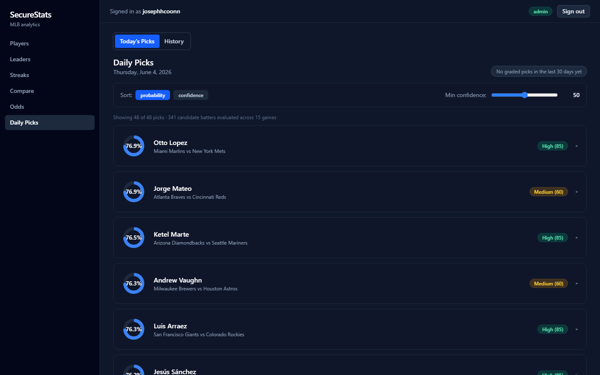
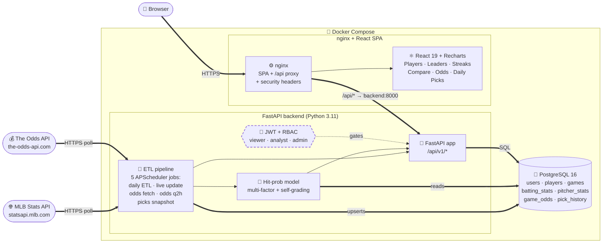
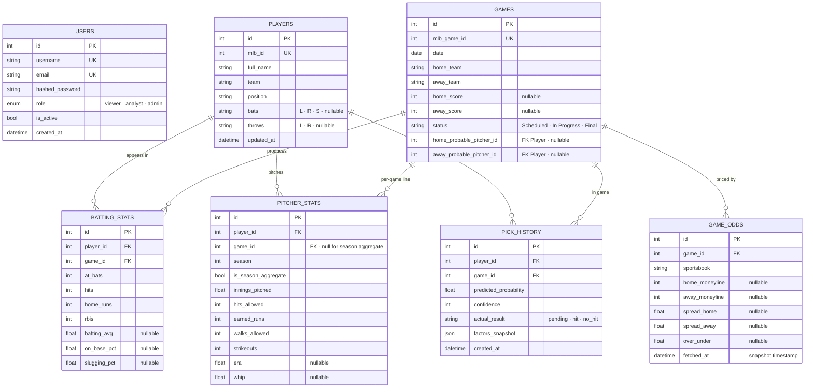
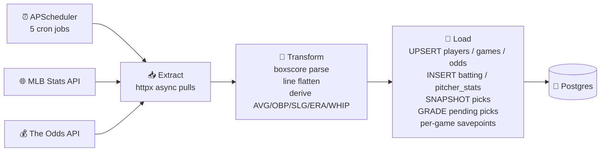

# 🟦 SecureStats

> **A full-stack MLB analytics + betting-edge platform.** Daily ETL from the official MLB Stats API + The Odds API, a multi-factor hit-probability model with self-grading accuracy tracking, FastAPI backend with JWT + role-based access, and a React + Recharts dashboard — all wrapped in Docker Compose and gated by GitHub Actions CI.

[](https://github.com/josephhcoonn-create/SecureStats/actions/workflows/ci.yml)


<p align="center">
  
  <br/>
  <em>Daily Picks tab — multi-factor hit-probability rings, confidence badges, sort + min-confidence controls. 48 picks across 15 games, click any card for the full factor breakdown + live odds.</em>
</p>

---

## 📐 Architecture



The dashed **JWT + RBAC** boundary gates every `/api/v1/*` route by user role. The `db` and `backend` containers have no published ports in production — only the nginx-fronted SPA on `:8080` is reachable.

---

## ✨ Features

- **🔐 Auth & RBAC** — JWT bearer tokens, bcrypt-hashed passwords, three-tier role system (viewer → analyst → admin)
- **🔄 Automated ETL** — daily 06:00 ET full pull + 15-minute live updates for in-progress games + pitcher boxscore ingestion + probable starter hydration, with savepoint-per-game so one bad box score doesn't poison the run
- **📊 Real analytics** — batting leaders, hot/cold streak detection (window functions), 95% CI hit-probability estimator
- **🎯 Multi-factor hit-probability model** — weighted blend of recent / season / career / home-away / opposing pitcher (ERA + WHIP) / handedness matchup → per-AB rate converted to per-game probability via `1 − (1−p)⁴`. Surfaces 2-5 high-conviction "Daily Picks" per slate at the **0.72 game-level threshold + min-50 confidence**
- **💰 Live betting odds** — every 10 AM + 2-hour line-movement snapshots from The Odds API (free tier: 500 calls/month). Best moneyline per game highlighted across DraftKings / FanDuel / BetMGM / BetRivers / Bovada / etc.
- **📜 Pick history with self-grading** — every snapshot lands in `pick_history` as `pending`; the next ETL run grades them `hit` / `no_hit` based on actual batting lines. `/picks/accuracy` shows real-world model performance with per-confidence-tier breakdowns
- **📈 Polished UI** — slate-themed responsive dashboard with sortable tables, expandable rows, Recharts radial gauges and radars, debounced typeaheads, plus **Odds** and **Daily Picks** tabs with circular probability rings
- **🐳 One-command stack** — `docker compose up --build` brings up Postgres + FastAPI + nginx-served React
- **🤖 CI/CD** — GitHub Actions runs ruff, pytest with 70% coverage gate, ESLint, and a full docker-compose build on every push
- **🛡️ Hardened nginx + slowapi rate limiting** — CSP, X-Frame-Options, security headers on every response; 5/min on `/auth/login`, 3/min on `/auth/register`, 60/min default
- **🧪 323 tests, ~85% coverage** — unit, integration, and end-to-end API tests with deterministic fixture datasets and respx-mocked external APIs (Odds + MLB) so the suite runs offline

---

## 🧱 Tech Stack

### Backend
| Tool | Purpose | Version |
|---|---|---|
| Python | Runtime | 3.11 |
| FastAPI | HTTP framework | 0.111 |
| SQLAlchemy (async) | ORM | 2.0 |
| psycopg | Postgres driver | 3.3 |
| Alembic | Schema migrations | 1.13 |
| Pydantic | Request/response validation | 2.x |
| python-jose | JWT signing | 3.3 |
| bcrypt | Password hashing | 4.3 |
| APScheduler | ETL scheduler (5 jobs) | 3.10 |
| httpx | MLB + Odds API client | 0.27 |
| slowapi | Per-IP rate limiting | 0.1.9 |
| python-json-logger | Structured JSON logs (opt-in) | 2.0 |
| respx | HTTP mocking in tests | 0.21 |
| pytest + pytest-cov | Test runner + coverage | 8.2 / 5.0 |
| ruff | Lint + import sort | 0.6.9 |

### Frontend
| Tool | Purpose | Version |
|---|---|---|
| React | UI library | 19 |
| Vite | Build tool | 8 |
| React Router | Client routing | 7 |
| @tanstack/react-query | Server-state cache | 5 |
| Recharts | Charts (bar, radial, radar) | 3 |
| Tailwind CSS | Styling | 4 |
| @headlessui/react | Combobox primitives | 2 |
| Axios | HTTP client with JWT interceptor | 1 |

### Infrastructure
| Tool | Purpose | Version |
|---|---|---|
| PostgreSQL | OLTP store | 16-alpine |
| nginx | SPA host + reverse proxy | 1.27-alpine |
| Docker Compose | Service orchestration | v2 |
| GitHub Actions | CI/CD | — |

---

## 🚀 Quick Start

**Prerequisites:** [Docker](https://docs.docker.com/get-docker/) and Docker Compose v2.

```bash
git clone https://github.com/josephhcoonn-create/SecureStats.git
cd SecureStats
cp .env.example .env          # edit SECRET_KEY for anything non-local
docker compose up --build     # builds and starts db + backend + frontend
```

> **Optional but recommended:** to unlock the **Odds** tab + odds-attached
> daily picks, sign up at [the-odds-api.com](https://the-odds-api.com)
> for a free API key (500 calls/month — comfortable headroom for the
> built-in 10 AM + every-2-hour pulls) and set `THE_ODDS_API_KEY=...`
> in `.env`. Without it the odds endpoints + scheduler jobs degrade
> gracefully to no-ops and the picks still surface (just without odds
> rendered on each card).

The stack will:
1. Create the Postgres volume and run `pg_isready` until healthy
2. Boot FastAPI — `entrypoint.sh` runs `alembic upgrade head` then `uvicorn`
3. Serve the React SPA from nginx on **http://localhost:8080**

### Seed data

The schema is empty after a fresh start. The quickest path: one command
creates three demo users *and* backfills the last 7 days of MLB games:

```bash
docker compose exec backend python -m scripts.seed
```

| Username | Password | Role |
|---|---|---|
| `admin`   | `Admin123!`   | admin |
| `analyst` | `Analyst123!` | analyst |
| `viewer`  | `Viewer123!`  | viewer |

> **Change these in any non-local environment.** The seed bypasses
> Pydantic validation by hashing directly, but the API enforces 8+
> chars with mixed case and a digit for any user registered through
> `POST /auth/register`.

Other options:

```bash
# Longer backfill window (~5 min for 90 days)
docker compose exec backend python scripts/backfill.py --days 90

# Just trigger today's daily ETL (admin token required)
curl -X POST -H "Authorization: Bearer $TOKEN" \
     http://localhost:8080/api/v1/etl/trigger
```

### Reset the database (dev only)

```bash
docker compose exec backend python -m scripts.reset_db          # prompts
docker compose exec backend python -m scripts.reset_db --yes    # skip prompt
```

Drops the `public` schema, re-runs all migrations. Refuses to run when
`ENVIRONMENT=production`.

### Access

| What | URL |
|---|---|
| Dashboard | http://localhost:8080 |
| API docs (Swagger UI) | http://localhost:8000/docs |
| API docs (ReDoc) | http://localhost:8000/redoc |
| Health check | http://localhost:8000/health |

---

## 📡 API Documentation

Full interactive docs live at **http://localhost:8000/docs** (Swagger UI) and **/redoc**. Key endpoints:

### Auth (`/api/v1/auth/*`)
| Method | Path | Description |
|---|---|---|
| `POST` | `/auth/register` | Create a new viewer account |
| `POST` | `/auth/login` | Exchange username + password for a JWT (rate-limited 5/min/IP) |
| `POST` | `/auth/refresh` | Issue a new token when the current one is in its last 30 min |
| `GET` | `/auth/me` | Current user (requires bearer token) |

### Players (`/api/v1/players/*`) — viewer+
| Method | Path | Description |
|---|---|---|
| `GET` | `/players` | List + filter + paginate; sortable by name / team / pos / **G / AVG / HR / RBI** |
| `GET` | `/players/search?q=` | Typeahead by partial name |
| `GET` | `/players/{id}` | Profile + career aggregates |
| `GET` | `/players/{id}/stats` | Game-by-game log |

### Games (`/api/v1/games/*`) — viewer+
`GET /games`, `GET /games/today`, `GET /games/{id}`.

### Stats (`/api/v1/stats/*`) — analyst+
| Method | Path | Description |
|---|---|---|
| `GET` | `/stats/leaders?stat=&days=&limit=` | Top-N by batting_avg / HR / RBI / OPS |
| `GET` | `/stats/teams?stat=` | Team aggregates |
| `GET` | `/stats/hit-probability/{id}` | Simple weighted estimate + 95% CI (v1 model) |
| `GET` | `/stats/hit-probability-v2/{id}?game_id=&pitcher_id=` | **Multi-factor v2 model** with factor breakdown |
| `GET` | `/stats/daily-picks?min_probability=&min_confidence=&target_date=` | Today's picks meeting both thresholds |
| `GET` | `/stats/streaks?type=hot\|cold` | Rolling-window streak detection |
| `POST` | `/stats/compare` | 2–10 player side-by-side comparison |

### Picks (`/api/v1/picks/*`) — analyst+
| Method | Path | Description |
|---|---|---|
| `GET` | `/picks/today` | Today's high-conviction picks (defaults: 0.72 prob, 50 conf) with each pick's live odds attached. **Snapshots into `pick_history`** on every call (idempotent) |
| `GET` | `/picks/player/{id}` | Run the v2 model for one player against their next probable matchup |
| `GET` | `/picks/history?days=` | Retrospective per-day accuracy (re-runs the model) |
| `GET` | `/picks/accuracy?days=` | Snapshot-based accuracy from `pick_history` with confidence-tier breakdown |

### Odds (`/api/v1/odds/*`) — viewer+
| Method | Path | Description |
|---|---|---|
| `GET` | `/odds/today` | Today's games grouped by sportsbook; lazy-refreshes from upstream if cached rows are empty |
| `GET` | `/odds/game/{id}` | Line-movement history for one game (every snapshot newest first) |

### ETL (`/api/v1/etl/*`) — admin only
| Method | Path | Description |
|---|---|---|
| `POST` | `/etl/trigger?live_only=` | Manually run the daily or live-update pipeline |
| `POST` | `/etl/trigger-odds` | Manually pull The Odds API. Returns `quota_remaining` so you can keep an eye on the 500/month free tier |

---

## 🗄️ Database Schema



Migrations are managed with **Alembic** (`backend/alembic/`) and run automatically on container start.

---

## 🛡️ Security Features

| Layer | Mechanism |
|---|---|
| **Authentication** | JWT bearer tokens signed with HS256; default 60-min lifetime. `POST /auth/refresh` issues a new token when the current one is within the last 30 min of expiry |
| **Rate limiting** | slowapi per-IP throttling: 5/min on `/auth/login`, 3/min on `/auth/register`, 60/min default. Returns 429 with `Retry-After` |
| **Password storage** | bcrypt hashing (work factor 12) — passwords never logged or returned |
| **Password policy** | Min 8 chars, at least one uppercase, one lowercase, one digit; enforced at the Pydantic schema |
| **Authorization** | Three-tier RBAC: `viewer` < `analyst` < `admin`. Each route declares its minimum role via a `require_role()` dependency |
| **Input validation** | Pydantic v2 schemas at every request boundary with explicit `min_length`/`max_length` bounds and a `[A-Za-z0-9_-]{3,50}` regex on usernames; FastAPI returns 422 on shape mismatch |
| **Structured logging** | JSON or text format (toggleable via `LOG_FORMAT`); every auth event (success / failure / refresh) and every 4xx/5xx response is logged with category + action fields. Passwords and tokens are never logged |
| **CORS** | Restricted to the configured frontend origin (default `http://localhost:5173` for dev, `http://localhost:8080` for compose) |
| **SQL injection** | SQLAlchemy parameterized queries throughout — no raw SQL with user input |
| **Container isolation** | Backend runs as non-root `appuser` (uid 1000); db has no host port in production |
| **nginx hardening** | `X-Content-Type-Options: nosniff`, `X-Frame-Options: DENY`, `X-XSS-Protection`, `Referrer-Policy`, `Permissions-Policy`, locked-down CSP (`default-src 'self'`, no inline scripts, no eval) |
| **Build-time secrets** | `SECRET_KEY` injected via `.env`; example file ships with placeholder + a `python -c "import secrets; print(secrets.token_urlsafe(64))"` snippet |

**Defense in depth:** the FastAPI backend sets all of the above headers
*and* runs slowapi rate limiting even when accessed directly on
`:8000` — the nginx hardening in front is additive, not the only layer.

---

## 🔄 ETL Pipeline

The ETL pipeline (`backend/app/services/etl.py`) is responsible for keeping the local DB in sync with the MLB Stats API.



**Five scheduled jobs (all timezones America/New_York):**

| Job | Cron | Purpose |
|---|---|---|
| `daily_etl` | 06:00 daily | Full pull: schedule + boxscores + pitcher lines + season aggregate recalc + grade yesterday's pending picks + log 30-day model accuracy |
| `live_update` | every 15 min | In-progress games only; game-hours gate (12:00 – 01:00 ET) is inside the callable |
| `fetch_daily_odds` | 10:00 daily | First odds pull after opening lines drop |
| `fetch_odds_update` | 10:30 + every 2 hours through 18:30 | Line-movement snapshots; double-gated by hour AND `THE_ODDS_API_KEY` presence |
| `generate_daily_picks` | 12:00 + 16:00 | Snapshots that day's picks into `pick_history`; idempotent on `(player, game)` |

**Key design decisions:**
- **Savepoint per game** — if one game's box score is malformed, the rest of the day's run still commits.
- **Idempotent upserts** — re-running the same date is safe; `INSERT … ON CONFLICT DO UPDATE` on natural keys (`mlb_id`, `mlb_game_id`, `(game_id, sportsbook, fetched_at)`, `(player_id, game_id)`).
- **Skeleton game rows** — scheduled (pre-game) games are upserted even when no batting data exists yet, so the picks engine + probable-pitcher upsert + odds matcher all have something to attach to.
- **Backfill mode** — `scripts/backfill.py --days N` or `--start / --end` walks `run_etl_for_date()` over a window for historical loads.
- **Manual override** — admins can hit `POST /api/v1/etl/trigger` (full daily) or `POST /api/v1/etl/trigger-odds` (odds only) from the API to force a synchronous run.
- **Quota safety** — every Odds API response surfaces `x-requests-remaining` and `x-requests-used`; logged on every fetch and returned by the trigger endpoint.

---

## 📊 Analytics

### Hit probability model — two flavors

**v1 (`GET /stats/hit-probability/{id}`)** — single-batter, per-AB, no opposing pitcher. Per-AB probability returned with a 95% confidence interval.

```
p = 0.5 × recent_avg (last 30 games)
  + 0.3 × career_avg
  + 0.2 × league_avg
SE = sqrt(p × (1 − p) / n)
CI = [p − 1.96·SE, p + 1.96·SE]
```

Confidence label: `low` (<15 AB), `medium` (15–49), `high` (≥50).

**v2 (`GET /stats/hit-probability-v2/{id}?game_id=&pitcher_id=`)** — multi-factor weighted blend with explicit pitcher matchup + handedness, converted to a per-GAME probability so picks are scored against the realistic "≥1 hit today" question instead of an unreachable per-AB bar.

**Weight schedule (sums to 1.00):**

| Weight | Factor |
|---|---|
| 0.30 | Recent avg (last 15 final games) |
| 0.15 | Season avg (current calendar year) |
| 0.10 | Career avg |
| 0.05 | Home/away split for this game's venue |
| 0.30 | Pitcher composite (ERA + WHIP + handedness modifier) |
| 0.10 | League baseline |

**Pitcher composite math:**

```
era_term  = (pitcher_era / 4.20) × league_avg
whip_term = (pitcher_whip / 1.30) × league_avg
composite = mean(era_term, whip_term) + handedness
```

> Both terms scale **directly** with the pitcher stat — lower ERA / WHIP → smaller composite → fewer expected hits. The original Phase 8.2 brief had `(league_era / pitcher_era)` which inverted this, boosting picks against ace pitchers. The codebase fixes it; the [analytics docstring](backend/app/services/analytics.py) flags the departure from the brief.

**Handedness modifier:**
- `+0.015` — opposite-hand matchup (LHB vs RHP, or switch hitter vs either)
- `−0.010` — same-hand matchup
- `0.00` — handedness unknown for either side

**Per-AB → per-game conversion:**

```
per_ab  = clamped per-AB blend  (clamped to [0.001, 0.999])
per_game = 1 − (1 − per_ab)^4   ← 4 = expected starting-batter ABs
prob = clamp(per_game, [0.05, 0.95])
```

**Daily pick threshold:** `DAILY_PICK_THRESHOLD = 0.72` — surfaces ~2-5 high-conviction picks per 15-game slate. A .340 season hitter on a hot streak vs a slightly-worse-than-league-average pitcher lands here. Tunable from a single constant in `app/services/analytics.py`.

**Confidence scoring (0-100):**

| Season AB | Base | + Pitcher boost (≥50 IP) | Notes |
|---|---|---|---|
| < 30 | 30 | +10 = 40 | "low" tier |
| 30 – 99 | 60 | +10 = 70 | "medium" tier |
| ≥ 100 | 85 | +10 = 95 | "high" tier, capped at 100 |

### Daily picks + self-grading accuracy

- `GET /stats/daily-picks` or `GET /picks/today` runs the v2 model over every batter who appeared in 3+ of their team's last 5 games (heuristic stand-in for real lineups), filters by `min_probability` (default 0.72) + `min_confidence` (default 50), sorts descending.
- Every pick lands in `pick_history` as `pending` via an idempotent UPSERT keyed on `(player_id, game_id)`. Repeat calls don't duplicate.
- The **next** daily ETL run grades pending rows whose games went `Final`: looks up the player's batting line, marks `hit` if `hits > 0` else `no_hit`. Players who didn't appear stay `pending` (so a healthy scratch doesn't pollute accuracy stats).
- `GET /picks/accuracy?days=30` reads from `pick_history` and reports total / correct / accuracy %, plus mean predicted probability for correct vs incorrect groups (does the model over- or under-confidence?), plus a per-confidence-tier breakdown.
- The dashboard's **Daily Picks** tab renders the live picks as expandable cards with circular probability rings + factor breakdown + the game's live odds; the **History** sub-tab shows the accuracy trend chart (7-day rolling) and per-day table.

### Other analytics

- **Leaderboards** — qualified players only (`MIN_AB_LEADERS = 10`), optional rolling window via `?days=N`.
- **Streak detection** — `func.row_number().over(partition_by=player_id, order_by=date desc)` + window aggregate; hot ≥ .350 / cold ≤ .150 over min 5 games.
- **Player comparison** — career totals + last-10 form for 2–10 players in a single query, with a `leaders` dict identifying the best player per stat.

### Live betting odds

- Pulled from [The Odds API](https://the-odds-api.com) (free tier: 500 calls/month).
- Scheduler hits the upstream once at 10:00 ET + every 2 hours until 19:00 ET — comfortably under the quota even if a fetch fails and retries.
- Every response inserts one row per `(game, sportsbook, fetched_at)` triplet so we can chart line movement over time.
- Quota burn is surfaced on every call: `/etl/trigger-odds` returns `quota_remaining` + `quota_used`; scheduler logs them on each fetch.
- Dashboard's **Odds** tab renders each game as a card with a mini odds table across all books, best moneyline highlighted in emerald, auto-refreshes every 5 minutes via react-query.

---

## 🧪 Testing

```bash
cd backend
pip install -r requirements.txt -r requirements-dev.txt

# Lint
ruff check .

# Tests + coverage (CI enforces ≥ 70%)
pytest --cov=app --cov-report=term --cov-fail-under=70
```

| Suite | Count | Notes |
|---|---|---|
| `tests/test_auth.py` | 16 | Register / login / RBAC dependency |
| `tests/test_security.py` + `test_security_attacks.py` | 26 | Rate limit, CORS, security headers, SQL injection, XSS, expired/tampered tokens, weak passwords |
| `tests/test_etl.py` | 18 | Mocked MLB responses + DB upsert paths |
| `tests/test_pitcher_pipeline.py` | 9 | Boxscore pitching parse, probable pitchers, season aggregate recalc |
| `tests/test_odds_client.py` | 14 | Odds API parser + matcher + quota tracking (respx-mocked) |
| `tests/test_odds_etl_integration.py` | 11 | Scheduler job registration, `OddsRefreshResult`, `/etl/trigger-odds` admin endpoint |
| `tests/test_odds_picks_api.py` | 15 | `/odds/today`, `/odds/game/{id}`, `/picks/today`, `/picks/player/{id}`, `/picks/history` |
| `tests/test_pick_accuracy.py` | 9 | `_snapshot_picks` idempotency, grading semantics, `get_model_accuracy` confidence breakdown |
| `tests/test_enhanced_hit_probability.py` + `_edges.py` | 24 | Handedness matrix, confidence buckets, pitcher composite, clamps, switch hitters, no-data fallbacks |
| `tests/test_players_games.py` | 34 | Player + game CRUD, filters, pagination |
| `tests/test_stats.py` | 39 | Leaders / streaks / v1 hit-prob / compare with seeded data |
| `tests/test_api_comprehensive.py` | 65 | End-to-end against a rich 11-player × 5-game fixture; exact `pytest.approx` assertions on every analytical value |
| **Total** | **323** | **~85% coverage** |

Frontend:
```bash
cd frontend
npm ci
npm run lint     # ESLint
npm run build    # Type-check + bundle
```

---

## 🗺️ Roadmap

**Recently shipped (Phase 7 + 8):**
- [x] **Rate limiting + structured logging + security hardening** (Phase 7.1)
- [x] **Pitching stats** — extend ETL + schema for ERA / WHIP, plus per-game vs season-aggregate split (Phase 8.3)
- [x] **Multi-factor hit probability** — recent / season / career / home-away / pitcher composite / handedness / league baseline; per-AB → per-game conversion (Phase 8.2)
- [x] **Live betting odds** — The Odds API integration with line-movement tracking + quota guarding (Phase 8.1)
- [x] **Pick history + self-grading accuracy** — snapshot at prediction time, grade after games final, surface trend in `/picks/accuracy` (Phase 8.5)
- [x] **Dashboard Odds + Daily Picks tabs** — probability rings, confidence badges, factor breakdowns, line-movement chart (Phase 8.6)

**Still on the list:**
- [ ] **Batter handedness backfill** — extend the batting ETL to populate `Player.bats` so the handedness modifier fires against real data (currently only set for pitchers via their boxscore lines)
- [ ] **Probable-pitcher auto-resolution in `get_daily_picks`** — wire the model to read `Game.home_probable_pitcher_id` / `away_probable_pitcher_id` so picks use real matchup data instead of league baselines by default
- [ ] **WebSocket live updates** — push live boxscore deltas to the dashboard
- [ ] **ML hit probability** — gradient-boosted model on park / pitcher / weather features
- [ ] **Self-serve role management** — admin UI to promote / demote users
- [ ] **Frontend tests** — Vitest + React Testing Library
- [ ] **OpenTelemetry tracing** — backend spans for ETL + API → Grafana Tempo
- [ ] **Production deploy** — Render / Fly.io recipes with managed Postgres

---

## 📄 License

MIT — see [LICENSE](LICENSE). Built by [@josephhcoonn-create](https://github.com/josephhcoonn-create) with FastAPI, React, and a healthy respect for sabermetrics.
