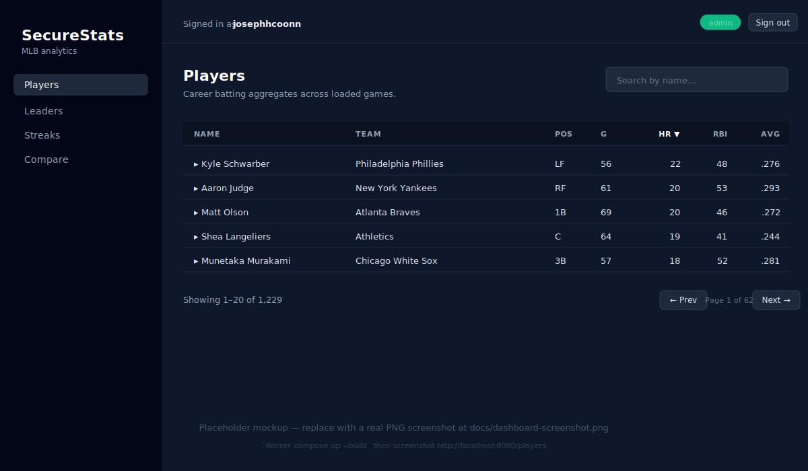
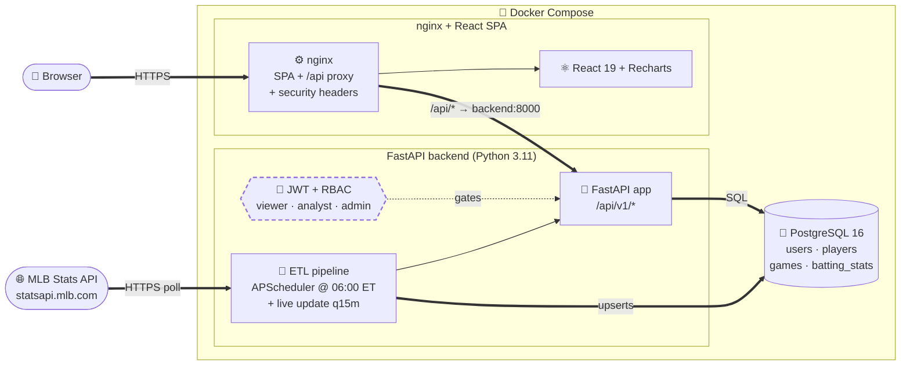
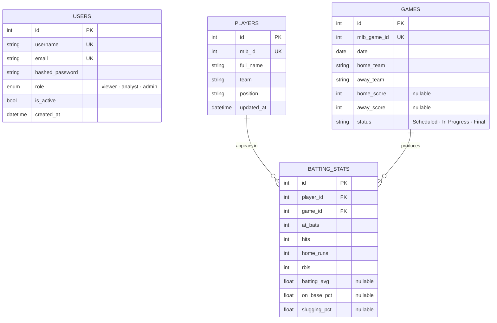
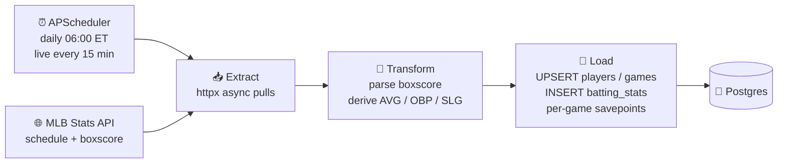

# 🟦 SecureStats

> **A full-stack MLB analytics platform.** Daily ETL from the official MLB Stats API, FastAPI backend with JWT + role-based access, and a React + Recharts dashboard — all wrapped in Docker Compose and gated by GitHub Actions CI.

[](https://github.com/josephhcoonn-create/SecureStats/actions/workflows/ci.yml)


<!-- Vector mockup so the README never shows a broken image. Replace with
     a real PNG capture (docs/dashboard-screenshot.png) when ready —
     see docs/README.md. -->
<p align="center">
  
  <br/>
  <em>Player table — sortable, searchable, with expandable game-log rows. <a href="docs/README.md">Replace with real screenshot →</a></em>
</p>

---

## 📐 Architecture



The dashed **JWT + RBAC** boundary gates every `/api/v1/*` route by user role. The `db` and `backend` containers have no published ports in production — only the nginx-fronted SPA on `:8080` is reachable.

---

## ✨ Features

- **🔐 Auth & RBAC** — JWT bearer tokens, bcrypt-hashed passwords, three-tier role system (viewer → analyst → admin)
- **🔄 Automated ETL** — daily 06:00 ET full pull + 15-minute live updates for in-progress games, with savepoint-per-game so one bad box score doesn't poison the run
- **📊 Real analytics** — batting leaders, hot/cold streak detection (window functions), 95% CI hit-probability estimator
- **📈 Polished UI** — slate-themed responsive dashboard with sortable tables, expandable rows, Recharts radial gauges and radars, debounced typeaheads
- **🐳 One-command stack** — `docker compose up --build` brings up Postgres + FastAPI + nginx-served React
- **🤖 CI/CD** — GitHub Actions runs ruff, pytest with 70% coverage gate, ESLint, and a full docker-compose build on every push
- **🛡️ Hardened nginx** — CSP, X-Frame-Options, X-Content-Type-Options, Referrer-Policy, Permissions-Policy all set on every response
- **🧪 172 tests, ~85% coverage** — unit, integration, and end-to-end API tests with a deterministic fixture dataset

---

## 🧱 Tech Stack

### Backend
| Tool | Purpose | Version |
|---|---|---|
| Python | Runtime | 3.11 |
| FastAPI | HTTP framework | 0.111 |
| SQLAlchemy (async) | ORM | 2.0 |
| psycopg | Postgres driver | 3.3 |
| Alembic | Schema migrations | 1.13 |
| Pydantic | Request/response validation | 2.x |
| python-jose | JWT signing | 3.3 |
| bcrypt | Password hashing | 4.3 |
| APScheduler | ETL scheduler | 3.10 |
| httpx | MLB API client | 0.27 |
| pytest + pytest-cov | Test runner + coverage | 8.2 / 5.0 |
| ruff | Lint + import sort | 0.6.9 |

### Frontend
| Tool | Purpose | Version |
|---|---|---|
| React | UI library | 19 |
| Vite | Build tool | 8 |
| React Router | Client routing | 7 |
| @tanstack/react-query | Server-state cache | 5 |
| Recharts | Charts (bar, radial, radar) | 3 |
| Tailwind CSS | Styling | 4 |
| @headlessui/react | Combobox primitives | 2 |
| Axios | HTTP client with JWT interceptor | 1 |

### Infrastructure
| Tool | Purpose | Version |
|---|---|---|
| PostgreSQL | OLTP store | 16-alpine |
| nginx | SPA host + reverse proxy | 1.27-alpine |
| Docker Compose | Service orchestration | v2 |
| GitHub Actions | CI/CD | — |

---

## 🚀 Quick Start

**Prerequisites:** [Docker](https://docs.docker.com/get-docker/) and Docker Compose v2.

```bash
git clone https://github.com/josephhcoonn-create/SecureStats.git
cd SecureStats
cp .env.example .env          # edit SECRET_KEY for anything non-local
docker compose up --build     # builds and starts db + backend + frontend
```

The stack will:
1. Create the Postgres volume and run `pg_isready` until healthy
2. Boot FastAPI — `entrypoint.sh` runs `alembic upgrade head` then `uvicorn`
3. Serve the React SPA from nginx on **http://localhost:8080**

### Seed data

The schema is empty after a fresh start. The quickest path: one command
creates three demo users *and* backfills the last 7 days of MLB games:

```bash
docker compose exec backend python -m scripts.seed
```

| Username | Password | Role |
|---|---|---|
| `admin`   | `Admin123!`   | admin |
| `analyst` | `Analyst123!` | analyst |
| `viewer`  | `Viewer123!`  | viewer |

> **Change these in any non-local environment.** The seed bypasses
> Pydantic validation by hashing directly, but the API enforces 8+
> chars with mixed case and a digit for any user registered through
> `POST /auth/register`.

Other options:

```bash
# Longer backfill window (~5 min for 90 days)
docker compose exec backend python scripts/backfill.py --days 90

# Just trigger today's daily ETL (admin token required)
curl -X POST -H "Authorization: Bearer $TOKEN" \
     http://localhost:8080/api/v1/etl/trigger
```

### Reset the database (dev only)

```bash
docker compose exec backend python -m scripts.reset_db          # prompts
docker compose exec backend python -m scripts.reset_db --yes    # skip prompt
```

Drops the `public` schema, re-runs all migrations. Refuses to run when
`ENVIRONMENT=production`.

### Access

| What | URL |
|---|---|
| Dashboard | http://localhost:8080 |
| API docs (Swagger UI) | http://localhost:8000/docs |
| API docs (ReDoc) | http://localhost:8000/redoc |
| Health check | http://localhost:8000/health |

---

## 📡 API Documentation

Full interactive docs live at **http://localhost:8000/docs** (Swagger UI) and **/redoc**. Key endpoints:

### Auth (`/api/v1/auth/*`)
| Method | Path | Description |
|---|---|---|
| `POST` | `/auth/register` | Create a new viewer account |
| `POST` | `/auth/login` | Exchange username + password for a JWT (rate-limited 5/min/IP) |
| `POST` | `/auth/refresh` | Issue a new token when the current one is in its last 30 min |
| `GET` | `/auth/me` | Current user (requires bearer token) |

### Players (`/api/v1/players/*`) — viewer+
| Method | Path | Description |
|---|---|---|
| `GET` | `/players` | List + filter + paginate; sortable by name / team / pos / **G / AVG / HR / RBI** |
| `GET` | `/players/search?q=` | Typeahead by partial name |
| `GET` | `/players/{id}` | Profile + career aggregates |
| `GET` | `/players/{id}/stats` | Game-by-game log |

### Games (`/api/v1/games/*`) — viewer+
`GET /games`, `GET /games/today`, `GET /games/{id}`.

### Stats (`/api/v1/stats/*`) — analyst+
| Method | Path | Description |
|---|---|---|
| `GET` | `/stats/leaders?stat=&days=&limit=` | Top-N by batting_avg / HR / RBI / OPS |
| `GET` | `/stats/teams?stat=` | Team aggregates |
| `GET` | `/stats/hit-probability/{id}` | Weighted estimate + 95% CI |
| `GET` | `/stats/streaks?type=hot\|cold` | Rolling-window streak detection |
| `POST` | `/stats/compare` | 2–10 player side-by-side comparison |

### ETL (`/api/v1/etl/*`) — admin only
| Method | Path | Description |
|---|---|---|
| `POST` | `/etl/trigger?live_only=` | Manually run the daily or live-update pipeline |

---

## 🗄️ Database Schema



Migrations are managed with **Alembic** (`backend/alembic/`) and run automatically on container start.

---

## 🛡️ Security Features

| Layer | Mechanism |
|---|---|
| **Authentication** | JWT bearer tokens signed with HS256; default 60-min lifetime. `POST /auth/refresh` issues a new token when the current one is within the last 30 min of expiry |
| **Rate limiting** | slowapi per-IP throttling: 5/min on `/auth/login`, 3/min on `/auth/register`, 60/min default. Returns 429 with `Retry-After` |
| **Password storage** | bcrypt hashing (work factor 12) — passwords never logged or returned |
| **Password policy** | Min 8 chars, at least one uppercase, one lowercase, one digit; enforced at the Pydantic schema |
| **Authorization** | Three-tier RBAC: `viewer` < `analyst` < `admin`. Each route declares its minimum role via a `require_role()` dependency |
| **Input validation** | Pydantic v2 schemas at every request boundary with explicit `min_length`/`max_length` bounds and a `[A-Za-z0-9_-]{3,50}` regex on usernames; FastAPI returns 422 on shape mismatch |
| **Structured logging** | JSON or text format (toggleable via `LOG_FORMAT`); every auth event (success / failure / refresh) and every 4xx/5xx response is logged with category + action fields. Passwords and tokens are never logged |
| **CORS** | Restricted to the configured frontend origin (default `http://localhost:5173` for dev, `http://localhost:8080` for compose) |
| **SQL injection** | SQLAlchemy parameterized queries throughout — no raw SQL with user input |
| **Container isolation** | Backend runs as non-root `appuser` (uid 1000); db has no host port in production |
| **nginx hardening** | `X-Content-Type-Options: nosniff`, `X-Frame-Options: DENY`, `X-XSS-Protection`, `Referrer-Policy`, `Permissions-Policy`, locked-down CSP (`default-src 'self'`, no inline scripts, no eval) |
| **Build-time secrets** | `SECRET_KEY` injected via `.env`; example file ships with placeholder + a `python -c "import secrets; print(secrets.token_urlsafe(64))"` snippet |

**Defense in depth:** the FastAPI backend sets all of the above headers
*and* runs slowapi rate limiting even when accessed directly on
`:8000` — the nginx hardening in front is additive, not the only layer.

---

## 🔄 ETL Pipeline

The ETL pipeline (`backend/app/services/etl.py`) is responsible for keeping the local DB in sync with the MLB Stats API.



**Key design decisions:**
- **Savepoint per game** — if one game's box score is malformed, the rest of the day's run still commits.
- **Idempotent upserts** — re-running the same date is safe; `INSERT … ON CONFLICT DO UPDATE` on natural keys (`mlb_id`, `mlb_game_id`).
- **Backfill mode** — `scripts/backfill.py --days N` walks `run_etl_for_date()` over a window for historical loads.
- **Manual override** — admins can hit `POST /api/v1/etl/trigger` from the API to force a synchronous run.

---

## 📊 Analytics

### Hit probability model

`GET /api/v1/stats/hit-probability/{player_id}` returns the probability that a given player gets a hit in their next at-bat, with a 95% confidence interval.

**Formula:**

```
p = 0.5 × recent_avg + 0.3 × career_avg + 0.2 × league_avg
```

Then clamped to `[0, 1]`. The 95% CI uses the normal approximation to the binomial:

```
SE = sqrt(p × (1 − p) / n)
CI = [p − 1.96 × SE,  p + 1.96 × SE]
```

`n` = at-bats in the last 30 games (capped at the actual sample size). Confidence labels:
- `low` → < 15 AB
- `medium` → 15–49 AB
- `high` → ≥ 50 AB

The choice of weights (50/30/20) over-weights recent form while still regressing to the league mean — common in sabermetrics. Swappable in `app/services/analytics.py` if you want to tune.

### Other analytics

- **Leaderboards** — qualified players only (`MIN_AB_LEADERS = 10`), optional rolling window via `?days=N`.
- **Streak detection** — `func.row_number().over(partition_by=player_id, order_by=date desc)` + window aggregate; hot ≥ .350 / cold ≤ .150 over min 5 games.
- **Player comparison** — career totals + last-10 form for 2–10 players in a single query, with a `leaders` dict identifying the best player per stat.

---

## 🧪 Testing

```bash
cd backend
pip install -r requirements.txt -r requirements-dev.txt

# Lint
ruff check .

# Tests + coverage (CI enforces ≥ 70%)
pytest --cov=app --cov-report=term --cov-fail-under=70
```

| Suite | Count | Notes |
|---|---|---|
| `tests/test_auth.py` | 16 | Register / login / RBAC dependency |
| `tests/test_etl.py` | 18 | Mocked MLB responses + DB upsert paths |
| `tests/test_players_games.py` | 34 | Player + game CRUD, filters, pagination |
| `tests/test_stats.py` | 39 | Leaders / streaks / hit-prob / compare with seeded data |
| `tests/test_api_comprehensive.py` | 65 | End-to-end against a rich 11-player × 5-game fixture; exact `pytest.approx` assertions on every analytical value |
| **Total** | **172** | **84.75% coverage** |

Frontend:
```bash
cd frontend
npm ci
npm run lint     # ESLint
npm run build    # Type-check + bundle
```

---

## 🗺️ Roadmap

- [ ] **WebSocket live updates** — push live boxscore deltas to the dashboard
- [ ] **ML hit probability** — gradient-boosted model on park / pitcher / weather features
- [ ] **Pitching stats** — extend ETL + schema for ERA / WHIP / K/9
- [ ] **Self-serve role management** — admin UI to promote / demote users
- [ ] **Frontend tests** — Vitest + React Testing Library
- [ ] **OpenTelemetry tracing** — backend spans for ETL + API → Grafana Tempo
- [ ] **Production deploy** — Render / Fly.io recipes with managed Postgres

---

## 📄 License

MIT — see [LICENSE](LICENSE). Built by [@josephhcoonn-create](https://github.com/josephhcoonn-create) with FastAPI, React, and a healthy respect for sabermetrics.
